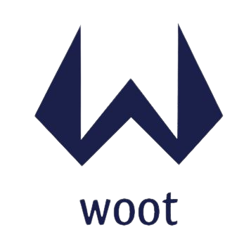

# Woot

> Workshop project aiming to find a solution to "How to curb the great resignation"

## Table of Contents

- [Woot](#woot)
  - [Table of Contents](#table-of-contents)
  - [General Information](#general-information)
  - [Technologies Used](#technologies-used)
  - [Features](#features)
  - [Screenshots](#screenshots)
  - [Setup](#setup)
  - [Development Server](#development-server)
  - [Production](#production)
  - [Project Status](#project-status)
  - [Room for Improvement](#room-for-improvement)
  - [Acknowledgements](#acknowledgements)
  - [Contact](#contact)

## General Information

- As part of a school workshop, we had to provide a solution within a week to solve a [given problem](https://github.com/alextison/woot/blob/main/assets/Subject.pdf): How to curb the great resignation ?
- We quickly thought about a solution that would allow employees to earn coins by doing good deeds and challenges to then spend them on free rewards as a free coffee.

## Technologies Used

- [Vue](https://vuejs.org/) - version >=3.0.0-0
- [Nuxt](https://nuxtjs.org/) - version 3.0.0-rc.11
- [Tailwind](https://tailwindcss.com/) - version >=3.0.0
- [SCSS](https://sass-lang.com/)

## Features

- Daily wheel
- Access to quests
- Access to shop
- Feedback form
- Login / Register (As a user or as an admin)

## Screenshots



## Setup

Make sure to install the dependencies:

```bash
# yarn
yarn install

# npm
npm install

# pnpm
pnpm install --shamefully-hoist
```

## Development Server

Start the development server on http://localhost:3000

```bash
npm run dev
```

## Production

Build the application for production:

```bash
npm run build
```

Locally preview production build:

```bash
npm run preview
```

## Project Status

Project is: _no longer being worked on but will be taken back one day_.

## Room for Improvement

To do:

- Dynamic quests and shop products
- Creation of new quests and shop products
- Quests completion and shop products purchase

## Acknowledgements

- Many thanks to all the bellow people who worked with me on this project.

## Contact

Created by [@alextison](https://github.com/alextison), [@greggameplayer](https://github.com/greggameplayer), [@Matthieu-Fontaine](https://github.com/Matthieu-Fontaine) !
